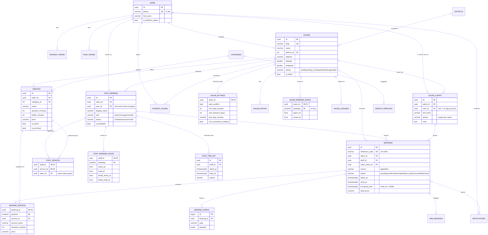

# ჩაეწერე — მონაცემთა ბაზის მოდელი (MVP)

PostgreSQL 16 · EF Core 10 (Npgsql) · 24 ცხრილი



> დიაგრამის წყარო: [`er-diagram.mmd`](er-diagram.mmd). სრული სქემა: [`../db/schema.sql`](../db/schema.sql).

## ძირითადი იდეა

- **`users`** — ყველა, ვინც ნომრით შედის: კლიენტი, მასტერი, მფლობელი. როლი მომხმარებელზე **არ** ინახება.
- **`staff_members`** — ვინ მუშაობს რომელ სალონში და რა როლით (`owner` / `manager` / `master`). ერთი ადამიანი შეიძლება ერთ სალონში მასტერი იყოს, მეორეში კლიენტი. მასტერი სისტემაში ჩნდება მოწვევისთანავე (`status = invited`, `user_id = null`) და ანგარიშს უკავშირდება, როცა მოწვევას მიიღებს.
- **`salon_clients`** — სალონის კლიენტის ბარათი. არსებობს აპის მომხმარებლისთვისაც და იმ კლიენტისთვისაც, ვინც ტელეფონით ჩაეწერა და აპი არ აქვს. შენიშვნა (ალერგია და ა.შ.) მხოლოდ ამ სალონს ეკუთვნის.
- **`bookings`** ყოველთვის მიუთითებს `salon_client`-ზე, არა პირდაპირ `user`-ზე. ასე ხელით და აპიდან დამატებული ჯავშნები ერთნაირად მუშაობს.

## ცხრილები

| ჯგუფი | ცხრილი | რას ინახავს |
|---|---|---|
| ცნობარი | `categories` | კატეგორიები: ფრჩხილი, თმა, წარბი… |
| | `service_templates` | სერვისების შაბლონები რეგისტრაციის ოსტატისთვის |
| | `districts` | ქალაქი + უბანი (ფილტრისთვის) |
| ანგარიშები | `users` | ტელეფონი (E.164), სახელი, პლატფორმის ადმინი |
| | `otp_codes` | SMS კოდები (მხოლოდ hash) |
| | `refresh_tokens` | შესვლის სესიები, როტაციით |
| | `push_tokens` | Expo push ტოკენები, ერთი თითო მოწყობილობაზე |
| სალონი | `salons` | პროფილი, მისამართი, კოორდინატები, სტატუსი |
| | `salon_settings` | ჯავშნის წესები (1:1) |
| | `salon_photos` | ფოტოები |
| | `salon_working_hours` | კვირის საათები (ჩანაწერი არ არის = დაკეტილია) |
| | `salon_closures` | დასვენების დღეები |
| სერვისები | `services` | ფასი, ხანგრძლივობა, დასუფთავების დრო, აპში ჩანს თუ არა |
| გუნდი | `staff_members` | მფლობელი / მენეჯერი / მასტერი |
| | `staff_services` | რომელი მასტერი რომელ სერვისს ასრულებს (M:N) |
| | `staff_working_hours` | მასტერის კვირის გრაფიკი + შესვენება |
| | `staff_time_off` | დაბლოკილი დრო |
| კლიენტები | `salon_clients` | სალონის კლიენტის ბარათი |
| | `favorite_salons` | რჩეული სალონები |
| ჯავშნები | `bookings` | ჯავშანი: ვინ, ვისთან, როდის, სტატუსი |
| | `booking_services` | ჯავშნის სერვისები — ფასის და სახელის **ასლი** |
| | `booking_events` | ისტორია: შეიქმნა, დადასტურდა, გადაიტანეს, გაუქმდა |
| შეტყობინებები | `notifications` | ზარის ხატულის სია (აპი და პანელი) |
| | `sms_messages` | SMS რიგი და ჟურნალი (ხარჯის დასათვლელადაც) |

## წესები, რომლებსაც ბაზა თავად იცავს

| წესი | როგორ |
|---|---|
| ერთ მასტერს ერთ დროს ორი ჯავშანი არ ექნება | `EXCLUDE USING gist` — ორი ერთდროული „დაჯავშნა“ → მეორე იღებს შეცდომას `23P01` |
| დასუფთავების დროც დაკავებულად ითვლება | ზედდებას ამოწმებს `starts_at`-დან `occupied_until`-მდე (`ends_at` + buffer) |
| გაუქმებული ჯავშანი დროს ათავისუფლებს | guard მოქმედებს მხოლოდ `pending / confirmed / completed / no_show` სტატუსებზე |
| მასტერი, კლიენტი და სერვისი ერთი სალონიდანაა | შედგენილი FK-ები `(id, salon_id)` |
| სერვისი არ იშლება, თუ ჯავშანი მიუთითებს | `booking_services → services` RESTRICT; სერვისი იარქივება (`is_archived`) |
| სალონი ვერ გამოქვეყნდება მისამართის და რუკის წერტილის გარეშე | CHECK `salons` ცხრილზე |
| ტელეფონი სწორ ფორმატშია | CHECK E.164: `+995599123456` |
| ერთ სალონში ერთი ნომერი ერთხელ | UNIQUE `(salon_id, phone)` |

ყველა ზემოთ ჩამოთვლილი შემოწმებულია ნამდვილ PostgreSQL 16-ზე: [`../db/tests/constraints_test.sql`](../db/tests/constraints_test.sql) (18 ტესტი).

## შეთანხმებები

- **id**: `uuid`, აპლიკაცია ქმნის `Guid.CreateVersion7()`-ით (დროით დალაგებული). ცნობარები — `integer identity`.
- **დრო**: `timestamptz`, ყოველთვის UTC. Npgsql `DateTimeOffset`-ს მხოლოდ offset 0-ით წერს → შენახვამდე `ToUniversalTime()`.
- **სამუშაო საათები**: ადგილობრივი `time` სალონის `time_zone`-ში (`Asia/Tbilisi`).
- **კვირის დღე**: `0 = კვირა … 6 = შაბათი` — იგივეა, რაც .NET `DayOfWeek` და JS `getDay()`.
- **ფული**: `numeric(10,2)`, ვალუტა ლარი.
- **enum-ები**: ბაზაში snake_case ტექსტი + CHECK (`BookingStatus.NoShow` → `no_show`).

## ჯავშნის შექმნა (ტრანზაქცია)

```text
BEGIN
  1. SELECT … FROM staff_members WHERE id = @staff FOR UPDATE      -- ერთი მასტერის ჯავშნები რიგში დგება
  2. შემოწმება: სამუშაო საათები, შესვენება, staff_time_off, salon_closures,
     min_lead_minutes / max_advance_days, მასტერი ასრულებს თუ არა ყველა სერვისს
  3. salon_clients: მოძებნე (salon_id, phone)-ით ან შექმენი
  4. INSERT bookings (+ booking_services, booking_events)
     → 23P01 (IsBookingOverlap) = „ეს დრო უკვე დაკავებულია“ → HTTP 409
COMMIT
```

`EXCLUDE` იცავს ჯავშანი-ჯავშნის ზედდებას ნებისმიერ შემთხვევაში. დაბლოკილ დროსთან (`staff_time_off`) შემოწმებას აკეთებს ნაბიჯი 1–2, რადგან ის სხვა ცხრილშია.

## როგორ გავუშვა

```bash
cd backend
docker compose up -d                                     # PostgreSQL 16 ლოკალურად
dotnet tool install --global dotnet-ef                   # ერთხელ
dotnet ef migrations add Initial \
  -p src/Chaetsere.Infrastructure -s src/Chaetsere.Infrastructure -o Persistence/Migrations
```

შემდეგ გახსენი შექმნილი `Initial` migration და დაამატე ორი ხაზი:

```csharp
protected override void Up(MigrationBuilder migrationBuilder)
{
    // … EF-ის დაგენერირებული კოდი …
    migrationBuilder.AddManualSql();      // EXCLUDE constraint + GiST index
}

protected override void Down(MigrationBuilder migrationBuilder)
{
    migrationBuilder.DropManualSql();
    // … EF-ის დაგენერირებული კოდი …
}
```

```bash
dotnet ef database update -p src/Chaetsere.Infrastructure -s src/Chaetsere.Infrastructure
```

ტესტები SQL სქემაზე (ცარიელ ბაზაზე):

```bash
psql -d chaetsere_test -v ON_ERROR_STOP=1 -f db/schema.sql -f db/tests/constraints_test.sql
```

## შემდეგი ეტაპისთვის (MVP-ში არ შედის)

- `reviews` — შეფასებები (`salons.rating_avg` / `rating_count` უკვე მზადაა)
- `payments` — ონლაინ გადახდა და ავანსი
- მასტერის ინდივიდუალური ფასი/ხანგრძლივობა სერვისზე (`staff_services`-ში სვეტები)
- PostGIS — როცა სალონები ათასობით იქნება; მანამდე `latitude/longitude` + Haversine საკმარისია
